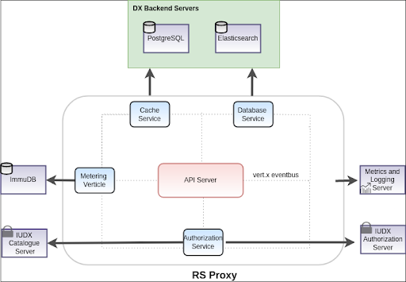

SETUP GUIDE
----

This document contains the installation and configuration processes
of the external modules of each Verticle in IUDX Resource Server Proxy.

<p align="center">

</p>

The Resource Server Proxy connects with various external dependencies namely
- `ELK` stack : used to capture and query temporal and spatial data.
- `PostgreSQL` :  used to store and query data related to
  - Token Invalidation
  - Subscription Status
- `ImmuDB` : used to store metering information


The Resource Server Proxy also connects with various DX dependencies namely
- Authorization Server : used to download the certificate for token decoding
- Catalogue Server : used to download the list of resources, access policies and query types supported on a resource.

## Setting up ELK for IUDX Resource Server Proxy
- Refer to the docker files available [here](https://github.com/datakaveri/iudx-deployment/blob/master/Docker-Swarm-deployment/single-node/elk) to setup ELK stack

**Note** : Access to HTTP APIs for search functionality should be configured with TLS and RBAC privileges

## Setting up PostgreSQL for IUDX Resource Server Proxy

-  Refer to the docker files available [here](https://github.com/datakaveri/iudx-deployment/blob/master/Docker-Swarm-deployment/single-node/postgres) to setup PostgreSQL

**Note** : PostgresQL database should be configured with a RBAC user having CRUD privileges

In order to connect to the appropriate Database, required information such as databaseIP, databasePort etc. should be updated in the DatabaseVerticle modules available in [config-example.json](example-config/config-dev.json).

**DatabaseVerticle**
```
{
    "id": "iudx.rs.proxy.database.DatabaseVerticle",
    "verticleInstances": <num-of-verticle-instance>,
    "databaseIP": "localhost",
    "databasePort": <port-number>,
    "databaseName": <database-name>,
    "databaseUserName": <username-for-database>
    "databasePassword": <password-for-database>,
    "poolSize": "25"
}
```
#### Schemas for PostgreSQL tables in IUDX Resource Server Proxy
1. Token Invalidation Table Schema
```
CREATE TABLE IF NOT EXISTS revoked_tokens
(
   _id uuid NOT NULL,
   expiry timestamp with time zone NOT NULL,
   created_at timestamp without time zone NOT NULL,
   modified_at timestamp without time zone NOT NULL,
   CONSTRAINT revoke_tokens_pk PRIMARY KEY (_id)
);
```


----

## Setting up ImmuDB for IUDX Resource Server Proxy
- Refer to the docker files available [here](https://github.com/datakaveri/iudx-deployment/blob/master/Docker-Swarm-deployment/single-node/immudb) to setup ImmuDB.

In order to connect to the appropriate ImmuDB database, required information such as meteringDatabaseIP,meteringDatabasePort etc. should be updated in the MeteringVerticle module available in [config-example.json](example-config/config-dev.json).

**MeteringVerticle**

```
{
    "id": "iudx.rs.proxy.metering.MeteringVerticle",
    "verticleInstances": <num-of-verticle-instances>,
    "meteringDatabaseIP": "localhost",
    "meteringDatabasePort": <port-number>,
    "meteringDatabaseName": <database-name>,
    "meteringDatabaseUserName": <username-for-immudb>,
    "meteringDatabasePassword": <password-for-immudb>,
    "meteringPoolSize": <pool-size>
}
```

**Metering Table Schema**
```
CREATE TABLE IF NOT EXISTS rsproxyauditingtable
(
    id uuid NOT NULL,
    api varchar NOT NULL,
    userid varchar NOT NULL,
    epochtime integer NOT NULL,
    resourceid varchar NOT NULL,
    isotime timestamp with timezone NOT NULL,
    providerid varchar NOT NULL,
    CONSTRAINT metering_pk PRIMARY KEY (id)
);
```

## Connecting with DX Catalogue Server

In order to connect to the DX catalogue server, required information such as catServerHost, catServerPort etc. should be updated in the AuthenticationVerticle and ApiServerVerticle modules available in [config-example.json](example-config/config-dev.json).

**AuthenticationVerticle**
```
{
    "id": "iudx.rs.proxy.authenticator.AuthenticationVerticle",
    "verticleInstances": <number-of-verticle-instances,
    "audience": <resource-server-host>,
    "keystore": <path/to/keystore.jks>,
    "keystorePassword": <password-for-keystore>,
    "authServerHost": <auth-server-host>,
    "catServerHost": <catalogue-server-host>,
    "catServerPort": <catalogue-server-port>,
    "serverMode": <server-mode>,
    "jwtIgnoreExpiry": <true | false>
}
```

**ApiServerVerticle**
```
{
    "id": "iudx.rs.proxy.apiserver.ApiServerVerticle",
    "ssl": true,
    "production": false,
    "keystore": <path/to/keystore.jks>,
    "keystorePassword": <password-for-keystore>,
    "rsAdmin": <resource-server-admin>,
    "httpPort": <port-to-listen>,
    "verticleInstances": <number-of-verticle-instances>,
    "catServerHost": <catalogue-server-host>,
    "catServerPort": <catalogue-server-port>
}
```

## Connecting with DX Authorization Server

In order to connect to the DX authentication server, required information such as authServerHost should be updated in the AuthenticationVerticle module available in [config-example.json](example-config/config-dev.json).

**AuthenticationVerticle**
```
{
    "id": "iudx.resource.server.authenticator.AuthenticationVerticle",
    "verticleInstances": <number-of-verticle-instances,
    "audience": <resource-server-host>,
    "keystore": <path/to/keystore.jks>,
    "keystorePassword": <password-for-keystore>,
    "authServerHost": <auth-server-host>,
    "catServerHost": <catalogue-server-host>,
    "catServerPort": <catalogue-server-port>,
    "resourceServerId": [[<resource-server-id>]],
    "serverMode": <server-mode>,
    "jwtIgnoreExpiry": <true | false>
}
```
