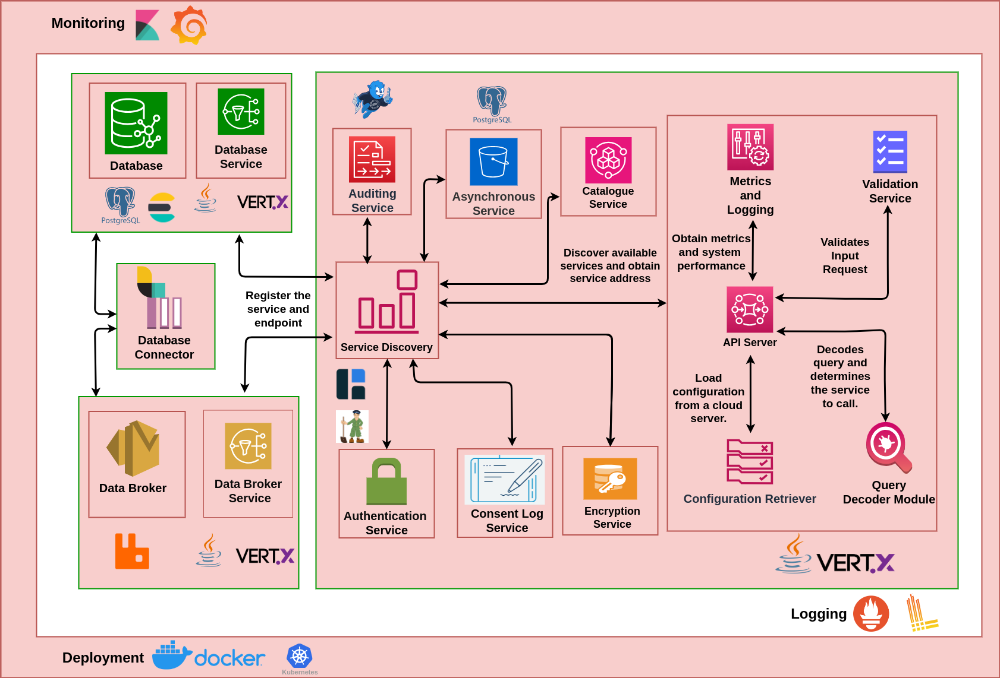

## Solution Architecture

The following block diagram shows different components/services used in implementing the DX RS-Proxy Server.

The above setup allows specific high load containers/services to scale with ease. Various services of the server are
detailed in the sections below.

### API Server

An API server is an HTTPS Web Server and serves as an API gateway for actors (consumers and providers) to interact with
the different services provided by the DX Resource Server. The APIs, wherever applicable, of the resource server, is
implemented as per the specification of NGSI-LD [1].
The API server performs query / input validation to ensure query conformance with the API specification before executing
the requested service. These services (as described below) may be database read/write services, databroker connector
registration services, etc.
It is also responsible for calling the Authorization Server (via the authorization service) to authenticate and
authorize access to restricted resources.

### Authentication Service

The authentication service interacts with the DX AAA Server to validate tokens provided by a user to fetch information
about their role and access restrictions.

### Cache Service

the cache service is used to store frequently accessed data temporarily in memory, allowing for faster
retrieval compared to fetching the data from a slower, underlying database or storage system. In the context of
dx catalogue item and revoked tokens related information, the cache service ensures that those data can be retrieved
quickly when
needed, without having to query the primary database repeatedly.

### Database Service

The Database Service is utilized by multiple services to store and retrieve the required data efficiently. It acts as
the central component that interfaces with the database, ensuring smooth communication between the application services
and the underlying data storage. Specifically, the summary and overview APIs retrieve their data from a PostgreSQL
database.

### Metering Service

The Metering Service handles metering (auditing) data by constructing auditing logs and publishing them to RabbitMQ (
RMQ) using the Data Broker service. It also supports the summary and overview APIs by serving data through the database
service.

### Data Broker Service

The Data Broker Service is utilized by the API Server to interact with the Data Broker (RabbitMQ - RMQ) for publishing
valid requests, auditing logs and consumes processed response. It also facilitates the creation and deletion of
connectors (queues) for DX Providers.

* **Publish Request** :
  For all search requests except metering APIs (overview, summary, provider, and consumer audit) the Rs-proxy server
  bypasses
  the database. After authorization and validation, it constructs a query JSON and publishes it to the
  **rpc-adapter-requests** exchange on the dataBroker (RMQ), using a routing key that includes the **resource ID**.

* **Consume Response** :
  The designated adaptor processes the request and sends the response back via RMQ. The Rs-proxy server consumes this
  response and forwards it to the consumer.
* **Publish Audit log** : It publishes the audited log on into **auditing** exchange with **routing key(*)**
* **Create connector** : It creates a queue (connector) for the provider on the dataBroker (RMQ).
* **Delete connector** : It deletes the provider's queue (connector) from the dataBroker (RMQ).

### Consent Logging Service

The Consent Logging Service is used by the API Server to log user-signed consent data related to Personally Identifiable
Information (PII) resources. This service ensures that all user consent actions are securely logged and tracked for
compliance and auditing purposes.